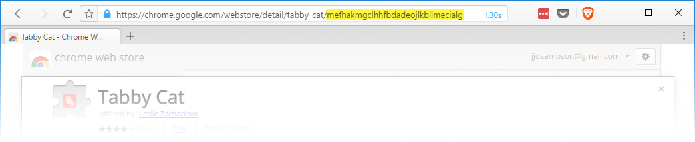
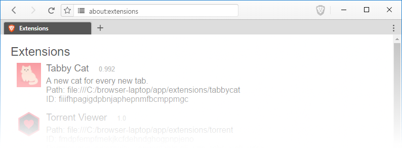
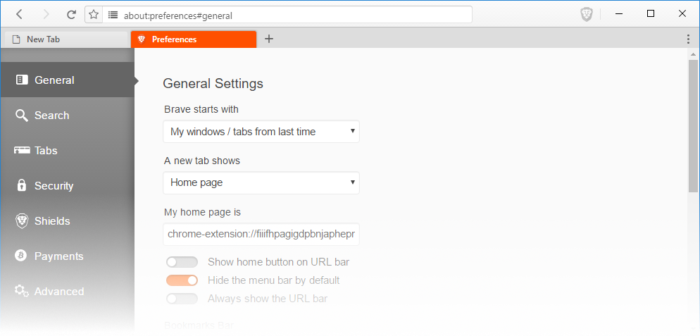

# Loading Chrome Extensions in Brave

Brave appeared on the scene last year, and was quick to make a name for itself. Out of the box, Brave users enjoy fewer ads and trackers online. Brave also includes safety benefits, like the prevention of fingerprinting and malware.

Like all software, Brave has its limitations. For example, Brave doesn't deliver playful, adorable kittens each time I open a new tab. For that type of functionality, users have to turn to a browser extension. Fortunately, Brave and Chrome share a common ancestor. As such, they have the capacity to share many of the same extensions.

## What are our goals?

In this walk-through we're going to clone Brave to our local machine. Next, we will install its dependencies.  And last, we will download a Chrome extension, and load it into Brave.  

My goal is to equip you with the information to explore this process with other extensions. With this knowledge, you can help us make Brave more compatible.

## Cloning Brave and installing dependencies

Assuming you already have [git](https://git-scm.com/downloads), [npm and node.js](https://nodejs.org) installed, getting started is straight-forward. We'll start by cloning [Brave's browser-laptop repo](https://github.com/brave/browser-laptop) onto our local machine.

Determine where you'd like to copy the Brave source code on your machine, and launch a terminal from that directory. I will be working out of my `c:\` directory.

Continue by running _git clone_ from our target directory:

```
git clone https://github.com/brave/browser-laptop.git  
```

This step shouldn't take long. Once completed, install the dependencies.

```
cd browser-laptop & npm install  
```

This will take a little longer than the cloning process, but shouldn't last for more than a few minutes. With dependencies installed, take a quick break and enjoy the fruits of your labor.

Open two terminals, and run `npm run watch` from the first. This launches the WebPack developer server. Once the server has been stood up, switch to the second terminal, and run `npm start`. Within a couple of moments, Brave should appear.

Take a break; pat yourself on the back. You made it this far!

## Downloading Chrome Extensions

Now that we have a local copy of Brave's source, and are able to run it, we can continue. If you haven't already, close all instances of Brave, and close both terminals. It's time to download an extension!

Downloading a Chrome extension often starts by installing the extension in Chrome. This alone requires several steps. Once installed, we have to go digging through our file system and move a handful of files. That's too much work; we'll take a shortcut.

Open a new terminal from the `browser-laptop` directory, and run the following command:  

```
npm install -g chrome-ext-downloader  
```

This command performs a _global_ install of the Chrome Extension Downloader (CED). This tool allows us to access the extension server, and pull down the packaged extension. Once downloaded, CED unpacks the archive into the current directory.

Once installed, it's time to get our extension. We'll want to make sure we install the extension into `app\extensions\`:

```
cd app\extensions & ced mefhakmgclhhfbdadeojlkbllmecialg  
```

The second command calls CED, asking it to download the Tabby Cat extension via its ID. You can find extension IDs in the address bar when browsing the [Chrome Web Store](https://chrome.google.com/webstore/category/extensions?).



For brevity, I'll rename the new folder to "tabbycat".

## Register and Load the Extension

At this point, we should have three folders in `app\extension\`: brave, torrent, and tabbycat.

We now need to register and load the Tabby Cat extension on startup. To do this, open the `app\extensions.js` file, and locate the following lines:

```
// Manually install the braveExtension and torrentExtension
extensionInfo.setState(config.braveExtensionId, extensionStates.REGISTERED)
loadExtension(config.braveExtensionId, getExtensionsPath('brave'), generateBraveManifest(), 'component')  
```

Beneath these lines, insert the following:

```
// Enable Tabby Cat
extensionInfo.setState('tabbycat', extensionStates.REGISTERED)
loadExtension('tabbycat', getExtensionsPath('tabbycat'))  
```

The first line is a simple comment for helping us find our way back if we ever get lost. The second line contains the `extensionInfo.setState` method; this registers our extension. The `loadExtension` method tells Brave where to locate the extension manifest.

## Testing and Troubleshooting

It's time to run Brave again. Open two terminals, and run `npm run watch` from the first. Once the webpack server has been stood up, switch to the second terminal, and run `npm start`. Within a couple of moments, Brave should appear.

Our first order of business is to confirm the extension loaded. We'll do this by navigating to the _about:extensions_ URL in Brave. We should see the extension listed among others.



> **Disclaimer:** At the time of this writing the extensions page may not display anything at all. Brave currently expects extension manifests to include an array of permissions. Tabby Cat does not contain a permissions array. This causes an error when we attempt to call the `Array.prototype.join` method. Pull Request [#6581](https://github.com/brave/browser-laptop/pull/6581) will resolve this when merged. A temporary work-around is to add `permissions: []` to the manifest.

## Filing bugs

Within a couple of seconds I also see that new tabs don't show adorable kittens. A quick glance at the extension manifest shows the use of `chrome_url_overrides.newtab`. I now have two jobs: first is to [file an issue](https://github.com/brave/browser-laptop/issues) on GitHub. Second is to find an alternative approach to delivering my much-needed kittens.

I can tell from the manifest that my goal is to see the `public\index.html` file. I can use the `chrome-extension://` protocol in Brave to access these files. Within a few seconds, I have the index.html file set as my homepage.



The last step of this journey is to _use the extension_, and file issues when necessary. This helps the Brave team address gaps in API support. It also helps us to identify which features are most important.

## Getting Help

This walk-through only scratches the surface. You may encounter issues not addressed in this document. If you find yourself needing help, consider joining [community.brave.com](https://community.brave.com). You may also reach out to me [on Twitter](https://twitter.com/bravesampson) and I'll help you find answers.
