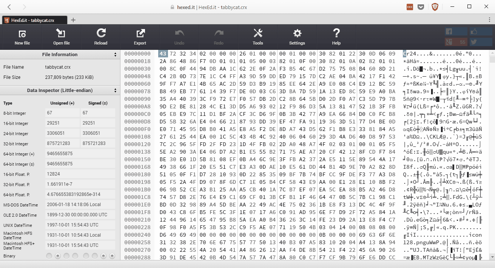

# Loading Chrome Extensions in Brave

## What is Brave?

Brave&mdash;the new ad-clobbering Browser from [Brendan Eich](https://twitter.com/brendaneich) (creator of JavaScript, co-founder of Mozilla)&mdash;burst onto the scene last year. Out of the box it blocks ads, trackers, [fingerprinting](https://en.wikipedia.org/wiki/Canvas_fingerprinting) and more.

For all that Brave does, it won't place random animated kittens on New Tabs&mdash;you'll need an extension for that. Fortunately, Brave was born out of the [Electron](http://electron.atom.io/) project (itself born out of the Chromium project), which means Brave and Chrome are not-too-distant cousins, and can share extensions.

In this walk-through, we're going to clone the Brave browser to our local machine, explore the process of loading extensions, and learn how we can use this knowledge to help Brave.

Because Brave is still a very new browser, support for extensions is experimental, but growing. By helping the Brave team explore your favorite extensions, support can be achieved more rapidly.

With this in mind, lets jump right in!

## Getting Brave's Source Code

One of the great things about Brave is the fact that it's light-weight. Like most websites, it consists of HTML, CSS, and JavaScript files.

Assuming you have [node and npm](https://nodejs.org/) already installed, you can be up and running with Brave in [under 8 minutes](https://twitter.com/BraveSampson/status/816155347278761986). And I mean that. I timed it. Twice. For Science.

Start by cloning the Brave project from GitHub:

> git clone https://github.com/brave/browser-laptop.git

This will create a `browser-laptop` directory. Enter that directory, and `npm-install` dependencies:

> cd browser-laptop

> npm install

This step takes me about 7.5 minutes, consistently.

## Downloading an extension without Chrome

Downloading Chrome extensions usually means having to go into Chrome, navigate to the internal extensions resource page, click a link, find the extension, click a button, and then do half a dozen other things&mdash;that's too much work.

Extensions can be downloaded directly from clients2.google.com. Lets go ahead and download the Tabby Cat extension.

Tabby Cat has an ID of _mefhakmgclhhfbdadeojlkbllmecialg_, so the download URL is https://clients2.google.com/service/update2/crx?response=redirect&prodversion=55&x=id%3D<mark>mefhakmgclhhfbdadeojlkbllmecialg</mark>%26uc.

## Converting the extension from a CRX to a ZIP

Chrome extensions come packaged as [CRX files](https://developer.chrome.com/extensions/crx). They're effectively ZIP archives, but with a little extra information before the content. For example, the first 4 bytes of a CRX represent the string "Cr24". The next 4 bytes tell us the CRX format number (usually `02 00 00 00`).

In order to unpack the CRX, we'll need to strip away the meta information. Fortunately, there's a great browser-based [tool](https://johankj.github.io/convert-crx-to-zip/) you can use to do this conversion. Simply drag and drop the CRX onto the target, and download the resulting ZIP.

You may get a notification complaining that the ZIP is "invalid". This happens for me with *some* extensions. Not to worry, it's not difficult to work around. And on the plus side, I get to show you another neat tool!

Hexed.it is an another awesome browser-based utility. It lets us open up a CRX, and view the individual bytes. With this utility, we can clearly see where the CTX headers end, the standard ZIP begins.

In the following animation you'll see the CRX for Tabby Cat has been loaded. I've selected everything (566 bytes in this case) _up to_ the first instance of "PK" (which are the first two bytes of the ZIP), and deleted.



With the extra CRX content removed from the file, I can now export my clearn ZIP, and get ready for extracting.

## Extracting our extension

At this point, we will extract the contents of the ZIP into Brave's `app\extensions` directory. Initially, this directory should have a `brave` folder, as well as a `torrent` folder. Lets extract our ZIP into a `tabbycat` directory.

## Registering and loading via app\extensions.js

With our extension unpacked, and in place, we now need it to be registered, and loaded. Open `app\extensions.js` and locate the following:

```
// Manually install the braveExtension and torrentExtension
extensionInfo.setState(config.braveExtensionId, extensionStates.REGISTERED)
loadExtension(config.braveExtensionId, getExtensionsPath('brave'), generateBraveManifest(), 'component')
```

We're going to duplicate these, make a couple minor modifications, and bring our Tabby Cat extension to life.

Beneath the lines seen above, lets add the following:

```
// Enable Tabby Cat
extensionInfo.setState('tabbycat', extensionStates.REGISTERED)
loadExtension('tabbycat', getExtensionsPath('tabbycat'))
```

These lines register and load our extension by its name, "`tabbycat`". The `getExtensionsPath` method accepts our extension's folder name. It will locate the `manifest.json` file within.

<!--## Necessary modifications

_This part of the document comes with an expiration date._

Presently, Brave doesn't support all of the extension APIs and features you'll find in Chrome (though we are actively closing that gap). For now, however, some extensions may require a few minor changes before they'll work, and Tabby Cat is no exception.

Befor we run Brave, and test Tabby Cat, we should make one small change to the `manifest.json` file.

At the top, add `"permissions": []` to the object.

```
{
    "update_url": "https://clients2.google.com/service/update2/crx",
    "manifest_version": 2,
```

We should now have this:

```
{
    "permissions": [],
    "update_url": "https://clients2.google.com/service/update2/crx",
    "manifest_version": 2,
```

The absensce of this property will currently cause problems for the `about:extensions` page in Brave. Don't worry, [we've filed an issue](https://github.com/brave/browser-laptop/issues/6533) :)-->

## Loading Brave

Now that we've pulled down our extension, unpacked it, registered it, loaded it, and made any needed modifications, we are ready to run the development build of Brave.

Start by opening two command windows from the `browser-laptop` directory. In your first window, run `npm install` (if you haven't already) to pull down all dependencies. This will take a few minutes.

Once our dependencies are installed, run `npm run watch` from the same window and wait for the webpack dev server to launch. Finally, turn your focus to the second window, and run `npm start`. Within a few seconds, Brave will make its grand appearance on your screen.

### Identify, File, and Fix!

At this point, your extension may be working flawlessly, or it may not be working at all. In my case, with Tabby Cat, it isn't working; new tabs don't yield a kitten.

I now have the genuine pleasure of identifying the problems, filing issues on GitHub, and helping the Brave team fix the root cause.

I notice immediately that new tabs don't show any kittens. First step is to make sure the extension is loaded. I can do this by going to `about:extensions` in Brave.

- New Tabs don't show a kitten. The issue here is with a lack of support for `chrome_url_overrides` in Brave.

## File Bugs and Discuss Efforts

    - Watch terminals, Brave console, and web content console
    - Explore extension pages using the `chrome://` protocol
    - File bugs online at github.com/brave/browser-laptop/issues
    - Discuss this process and more at community.brave.com