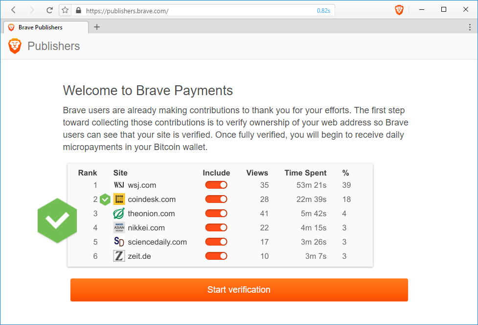

## GitHub Pages and Brave Payments

If you're anything like me, you're often throwing small projects and experiments onto GitHub Pages. This feature of GitHub enables creators like us to rapidly produce projects, and pump them out to the public. Why not get paid while you produce? That's precisely the point of this post. Okay, no more alliteration&mdash;promise �

Unlike pretty much every adblocker on the planet, Brave ships with its own built-in micro-donation apparatus&mdash;Brave Payments. Built on the ANONIZE protocol, this feature of Brave lets users make monthly donations to their favorite websites, proportional to the time spent on those sites.

