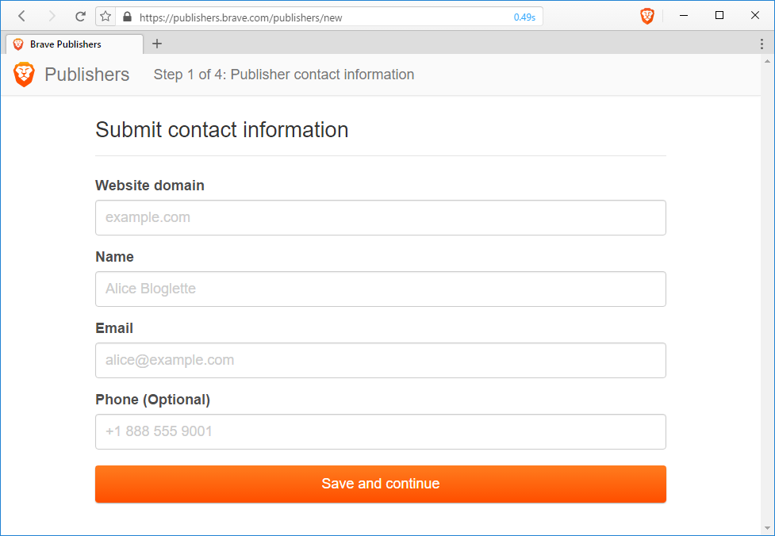
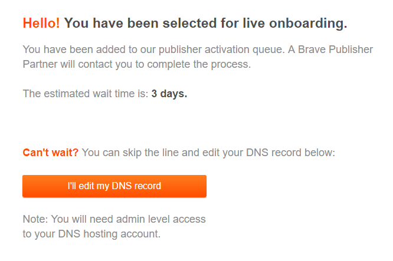
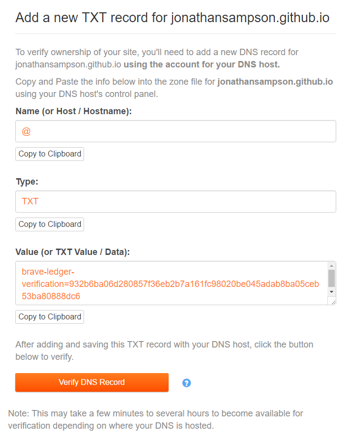
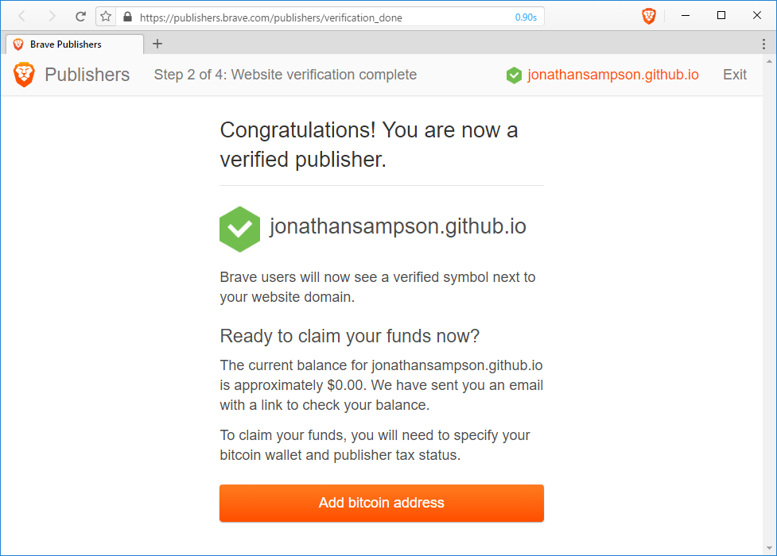

## GitHub Pages and Brave Payments

If you're anything like me, you're often throwing small projects and experiments onto GitHub Pages. This feature of GitHub enables creators like us to rapidly produce projects, and pump them out to the public. Why not get paid while you produce? That's precisely the point of this post. Okay, no more alliteration&mdash;promise �

Unlike pretty much every adblocker on the planet, Brave ships with its own built-in micro-donation apparatus&mdash;Brave Payments. Built on the ANONIZE protocol, this feature of Brave lets users make monthly donations to their favorite websites, proportional to the time spent on those sites.

In this brief article, I want to walk you through the process of getting your GitHub account registered so that you're eligible to receive micro-donations from me, and others like me. The entire process can be completed in minutes.

The first step is to visit publishers.brave.com. It is here you will start the process of _Verification_. The full process takes only a matter of minutes. When you're ready, click the _Start verification_ button to proceed.

We'll need a couple details about you, the site-owner. Because we're focusing on GitHub pages, you'll want to provide a URL like jonathansampson.github.io. Name, email address, and Phone number are all pretty self-explanatory :)

Onve you pressed _Save and continue_, you'll need to wait. The Brave Publisher system will review your submission and determine whether or not the site is elligible. This won't take long, but it could be a few minutes before you get the results.

Results will be emailed to the address provided. In the email you'll find a link that will carry you on to the next step of the process.

Edit your DNS, or create a `.well-known` repo.

Success email!

Add bitcoin address.